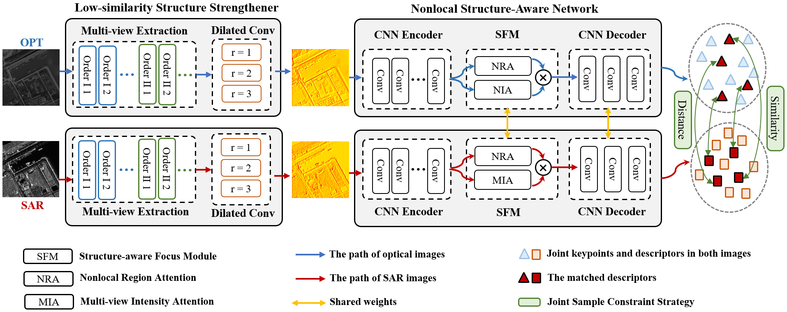

# Enhancing Optical-SAR image registration: A multi-view nonlocal structure-aware method
# 

## Requirements
Pytorch 2.1.1, Kornia 0.6.2

## Datasets
A small number of images are provided in Evaluation_dataset to test the code.

```bash
Evaluation_dataset/
└── VIS-SAR/
      └── test/
           ├── SAR/
           ├── transforms/
           ├── VIS/
      └── train/
           ├── SAR/
           ├── VIS/
      └── trans.py
└── ...
```

The full dataset is publicly available from the paper: [SAR-optical feature matching: A large-scale patch dataset and a deep local descriptor](https://doi.org/10.1016/j.jag.2023.103433)

The processing details of the dataset can be referred to: [ReDFeat](https://github.com/ACuOoOoO/ReDFeat)

## Train
```bash
python train.py --name --datapath
```
**name:** checkpoint

**datapath:** dataset path. If you're using the downloaded dataset, keep the directory style consistent.

## Evaluation
cd Evaluation_dataset

1.Extract features: **extract_features.py**

2.Evaluate the results of keypoint matching: **match_keypoints.py**

3.Evaluate the results of image registration: **registration.py**


